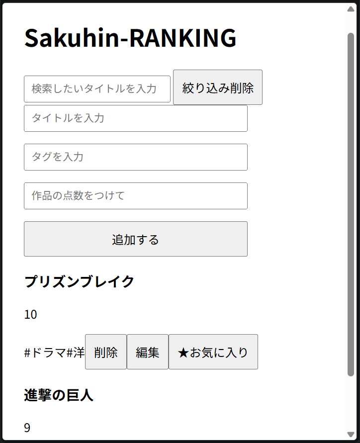

# sakuhin-ranking-app

作品のタイトルと評価を記録できるアプリです

##概要

TypeScriptの学習を目的として作成しました。
アニメ、ドラマ、映画、ゲームなどの作品を登録して、評価順に管理できます。

##公開URL
https://yu-konagai.github.io/sakuhin-ranking-app/

##機能
・作品登録
・編集
・削除
・タグ管理
・評価機能

##使用技術
・HTML
・CSS
・TypeScript
・localStorage

###作品登録
・タイトル
・タグ
・評価点数
を入力して作品を追加できます。

###作品編集
登録済みの作品を編集することができます。

###削除機能
登録済みの作品を削除することができます。

###タイトル検索
作品名で絞込検索ができます。

###タグ検索
タグをクリックすると同じタグの作品のみ表示できます。

###お気に入り機能
お気に入り作品を保存できます。

###データ保存
LocalStorageを使用してブラウザに保存してます。

##学んだこと
・TypeScriptの型定義
・LocalStrageを用いたデータ保存
・イベント処理
・配列メソッド

##スクリーンショット

